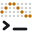

<div align="center">

<picture>
  <source media="(prefers-color-scheme: dark)" srcset="assets/logo-dark.svg">
  
</picture>

# dreeft

**Catch the drift of your Claude Code session's thinking, right above the prompt.**

[](https://github.com/achiurizo/dreeft/actions/workflows/check.yml)
[](LICENSE)
[](#requirements)


</div>

The transcript already shows the thinking itself. dreeft is a Claude Code mod that shows the data around it, in three rows:

- **Focus**: what the thinking keeps coming back to.
- **Timeline**: where the turn's time goes.
- **Meta**: what the turn costs.

By default: no model calls, no network requests, no file writes, and nothing sent to the model. Only two opt-in experiments change that: the [memory shadow log](#memory-shadow-log-experimental) and [steering](#steering-experimental). The band appears when a turn starts and stays up after it ends, until the next turn starts.

## Install

A mod installs as a Claude Code plugin. Inside Claude Code:

```text
/plugin marketplace add achiurizo/dreeft
/plugin install dreeft@dreeft
```

Restart Claude Code, or run `/reload-plugins`, to load it.

<details>
<summary>Install from source</summary>

Clone the repo:

```sh
git clone https://github.com/achiurizo/dreeft.git
```

Load the clone for one session:

```sh
claude --plugin-dir ./dreeft
```

Or load the clone in every session: add its absolute path to the `env` block of `~/.claude/settings.json`.

```json
{
  "env": { "CLAUDE_CODE_PLUGIN_DIRS": "/path/to/dreeft" }
}
```

If hot reloading is enabled in a session, edits to `hooks/` take effect without a restart.

</details>

### Update

Releases and their notes are on the [Releases page](https://github.com/achiurizo/dreeft/releases). For a marketplace install, this updates the mod to the latest version:

```sh
claude plugin update dreeft@dreeft
```

A session that is already running keeps the code it loaded. Restart it, or run `/reload-plugins`, to load the new code.

### Disable or uninstall

```sh
claude plugin disable dreeft@dreeft      # turn the mod off, keep it installed
claude plugin enable dreeft@dreeft       # turn it back on
claude plugin uninstall dreeft@dreeft    # remove it
```

A clone loaded with `--plugin-dir` is loaded for that session only. For a clone loaded in every session, remove its path from `CLAUDE_CODE_PLUGIN_DIRS`. None of these deletes the memory shadow log or the steering log: if you turned one on, delete its file yourself. Both logs are append-only and never trimmed, so each grows until you delete it.

## The three rows

### Focus: what the turn keeps coming back to


- The three names the turn comes back to most, with counts. A name has to come up at least twice to show. Until one does, the row reads `∴ …`, or `∴ ⟲ 2` when second-guesses have been counted.
- Names come from two places:
  - The turn's tool calls: the file a tool reads or edits, code names in a search pattern, and file names in a shell command. The file a tool reads or edits counts by its last part, whether the path uses `/` or the Windows `\`.
  - The thinking text, when thinking summaries are on: a backticked span, a file name or path, or a camelCase or snake_case identifier.
- A file name is a word that ends in one of these extensions: `.ts`, `.tsx`, `.js`, `.jsx`, `.mjs`, `.cjs`, `.json`, `.md`, `.py`, `.rb`, `.go`, `.rs`, `.sh`, `.fish`, `.toml`, `.yaml`, `.yml`, `.css`, `.html`, `.txt`. A `.tmpl` after the extension is part of the name (`chezmoi.toml.tmpl`). `Justfile`, `Makefile`, `Dockerfile`, `Gemfile` and `Rakefile` count too, in exactly that spelling.
- Plain words and directories don't count, and neither does a file with any other extension unless it is in backticks: `Make`, `makefile` and `main.cpp` are not file names. One exception, in the thinking text and in a search pattern: a path of three or more parts counts by its last part, whatever that part is. `src/hooks/utils` counts `utils`, and `src/hooks` counts nothing.
- A name is 3 to 40 characters of printable ASCII. A shorter or longer name, or one with any other character, does not count.
- A turn tracks at most 50 names. Past that, the name with the lowest count goes first, the oldest on a tie, so a name the turn keeps coming back to stays.
- `⟲ 2` counts second-guesses: a sentence in the thinking that opens with "Wait,", "Actually,", "Hmm,", "Oh,", "Oops," or "No,", or that narrates a change of mind ("I realize", "turns out", "on closer inspection", "reconsider"). The same words used as verb or adverb ("wait for CI", "actually works") do not count. Shown in amber. Needs thinking summaries on.
- This is a word-count heuristic, not a summary, so it can pick the wrong names.

### Timeline: where the time goes


One cell per second of the turn, so the strip grows while the turn runs, tool runs included. A long turn packs several seconds into each cell so the whole turn fits. When several phases touch one cell, it shows the most notable: thinking, then tool, then writing, then waiting. A turn keeps at most 240 phase changes: past that, the shortest phase folds into the one before it, so a very long turn can lose a sub-second burst from the strip and the totals.

Each cell is two lanes, thinking on top and tools below:

| Cell | Phase |
| --- | --- |
| `▀` | Thinking |
| `▄` | Tools running |
| `█` | The model writing: answer text or a tool call's arguments |
| blank | Waiting on the model |

A dim `▕` closes the strip, so trailing waiting time still reads as time.

With [`steer`](#steering-experimental) set to `on`, an amber `▲` takes the place of the cell for the second in which the mod sent the model a nudge. When a cell packs several seconds, the cell that holds that second shows the `▲`. With `steer` at `off` or `shadow` the strip never shows one.

After the strip, the time spent in each phase: `think 11s · tools 13s · write 5s`. A phase under half a second reads `<1s`. A phase with no time is left out. A minute or more reads `1m5s`. Waiting has no total.

Tool time starts when the model's response has ended and its tool calls start to run. It ends when the model is asked again or the turn completes. The time the model takes to stream a tool call's arguments is writing, so a long `Write` call reads as writing, not as a slow tool. Tool time is that whole gap, not a measured duration per tool, so a wait on a permission prompt counts.

Phases come from three sources: the model's chunks, the end of each response, and the mode of Claude Code's own spinner line. The spinner's modes map to phases: requesting is waiting, thinking is thinking, responding and tool input are writing, tool use is tools running. The spinner still reports thinking when thinking summaries are off and no thinking text streams.

### Meta: what the turn costs


| Part | Meaning |
| --- | --- |
| `◆ 11s` | Time spent thinking this turn |
| `2 blk` | Thinking blocks this turn |
| `3 tools` | Tool calls this turn |
| `▲ 1` | Steering nudges the mod sent to the model this turn, in amber. Absent at 0, so absent unless [`steer`](#steering-experimental) is `on`. |
| `+0.6%` | How much this turn grew the context, in points of the window. Amber at 10 points or more. Negative after a compaction. |
| `⣀⣠⣤⣴` | Growth of the last 20 turns, two turns per braille cell, scaled to the largest. An amber `↓` marks a compaction, including a `/compact` between turns. |

Growth and the trail are absent until Claude Code has reported the context's size. Until then the row reads `◆ 11s · 2 blk · 3 tools`.

### Good to know

- **Narrow terminals.** The band takes 60% of the columns Claude Code gives it, rounded down, and at most 84 cells. The meta row drops parts in this order: the tool count, then the trail, then the nudge count, then the whole row. The timeline drops its totals before it shrinks below 8 cells. The focus row drops names from the end and keeps the second-guess count. When no name fits, it reads `∴ ⟲ 2`. When the count does not fit either, the count drops whole and the row reads `∴ …`, then `∴` alone. When the band is short on rows, it keeps the bottom ones. With no rows to draw in, it draws nothing. The top row stops 4 cells short of the right edge, clear of the band's `[-]` collapse mark. When the band's width comes to under 12 cells, it draws nothing.
- **Surveys.** The band is hidden while Claude Code shows a survey.
- **Glyph width.** The band counts every glyph it draws as one cell: `∴`, `×`, `·`, `◆`, `⟲`, `…`, `↓`, `▲`, the timeline's blocks and the braille trail. A terminal set to draw ambiguous-width characters as two cells will misalign the rows.
- **Main conversation only.** Subagent thinking and turns are ignored.
- **Quiet by default.** The mod makes no model calls, network requests or file writes, and sends nothing to the model, unless you turn on an experiment. The [memory shadow log](#memory-shadow-log-experimental) makes model calls and writes a log. [Steering](#steering-experimental) writes a log, and at `on` appends a note the model reads.

## Requirements

- Claude Code v2.1.287 or later, which added mods. The mod API is still early access, so a Claude Code update can break the mod until it catches up.
- The terminal surface. The desktop app gets the band only when you set [`desktop`](#settings) to `on`, which is experimental and has not been checked. VS Code and mobile get nothing.
- Optional: thinking summaries turned on in `~/.claude/settings.json`:

  ```json
  { "showThinkingSummaries": true }
  ```

  Without this setting, the focus row gets names from tool calls only, and never counts second-guesses. The timeline and meta row work either way, because the spinner still reports thinking. With the setting on, the transcript also shows the thinking.

## Settings


| Setting | Default | Effect |
| --- | --- | --- |
| `palette` | `mono` | Timeline colors. `mono` uses brightness only (thinking plain, tools dim). `amber` and `blue` color thinking and keep tools dim. `magenta` colors thinking magenta and tools cyan. |
| `memoryShadow` | `off` | `on` turns on the experimental memory shadow log. See below. |
| `steer` | `off` | Experimental. `shadow` logs each time a turn's context growth crosses 10 and 20 points, and sends nothing. `on` also sends the model a short note on half of those crossings. See [Steering](#steering-experimental). Any other value is `off`. |
| `desktop` | `off` | Experimental. `on` also draws the band in the Claude Code desktop app. The band's drawing there has not been checked. When you try it, look at the braille trail, the dim text, the palette colors and the band's width. `off` draws on the terminal only. VS Code and mobile get nothing with either value. |

Change it with `/config`, or in `~/.claude/settings.json`:

```json
{
  "pluginConfigs": {
    "dreeft@dreeft": { "options": { "palette": "amber" } }
  }
}
```

The key is `dreeft@dreeft` for a marketplace install. A clone loaded with `--plugin-dir` or `CLAUDE_CODE_PLUGIN_DIRS` reads the key `dreeft` instead.

## What the mod reads, runs and sends

With every setting at its default, the mod reads the main conversation's model chunks (thinking text and tool call arguments), the spinner's mode and the context size. It keeps counts from them in session state and draws the band. It starts no program, makes no model call, reads no environment variable, writes no file and sends nothing anywhere.

The two experiments add the calls below. The mod makes no network request of its own in any mode: it never calls `$.net`.

| Call | When | What it does |
| --- | --- | --- |
| `$.model.complete` | `memoryShadow` is `on`, once per turn that has candidates | The mod's only way out. It sends one judge prompt to the model alias `haiku` through Claude Code, to your model provider, on your account. The prompt holds up to 6 quoted spans of the turn's thinking, each with a quoted tool result or answer sentence, and the project's name (the `origin` URL without credentials, query string or fragment, or the repo's directory name). Anything shaped like a credential is replaced with `[redacted]` first. |
| `$.process.run` with `git` | `memoryShadow` is `on`, once per load | Runs `git -C <session directory> rev-parse --path-format=absolute --git-common-dir`, `git -C <session directory> rev-parse --show-toplevel` and `git -C <session directory> remote get-url origin`, to name the project and find its main checkout. |
| `$.process.run` with `/bin/sh` | `memoryShadow` is `on`, or `steer` is `shadow` or `on` | Runs `/bin/sh -c '<script>' sh <log directory> <log file>` to append lines to a local log. The script is fixed text: `mkdir -p -- "${1%/*}" && umask 077 && mkdir -p -- "$1" && chmod 700 -- "$1" && : >> "$1/$2" && chmod 600 -- "$1/$2" && cat >> "$1/$2"`. The log file is `memory-shadow.jsonl` or `steer.jsonl`, both names fixed in the mod. No text from the session is part of the command: the lines go in on stdin. |
| `$.env.get` | with either log | Reads `HOME` and `XDG_STATE_HOME`, only to find the log directory: `$XDG_STATE_HOME/dreeft`, else `~/.local/state/dreeft`. Neither is a credential, and the mod reads no credential, token or key from your machine. |
| `$.session.cwd`, `$.session.id` | with either log | The session's directory goes to `git -C`. The session id goes into the log records. |
| `$.session.append` | `steer` is `on`, on a fired trigger | Appends one fixed two-sentence note the model reads, and a visible notice of it, to the conversation. |

Two of the mod's hooks have the name of an engine call, so they see that call when other code makes it. Neither changes it:

- `session.compact` runs the compaction unchanged and returns its result unchanged. It only adds the compaction mark to the band's trail.
- `tool.call` is registered only when `memoryShadow` is `on`. It runs the tool call unchanged, keeps a copy of a main-conversation result as evidence for the judge, and returns the result unchanged.

`hooks/shadow-candidates.ts` holds the patterns that find credentials to redact. Those patterns name commands such as `curl`, `wget` and `mysql` and their password flags. The file downloads nothing and runs nothing.

`hooks/shadow-candidates.test.ts` tests that redaction. It spells made-up values in the shapes the redactor has to catch: a GitHub token of the form `ghp_0123456789...`, a Slack webhook URL under `hooks.slack.com` filled with zeros, an AWS key id. None is a real credential. The test passes each string to the redactor and compares the result. It reads no environment variable and no file, and sends nothing. The mod itself reads no credential from your machine, and the tests run only when you run `claude plugin test .`.

## Memory shadow log (experimental)

A spike that measures whether the session's thinking holds durable facts worth keeping as memories. It only logs. It never writes to a memory store, never stages memory candidates, and never changes the turn. The band shows nothing new.

<details>
<summary>What it logs, and how to read it</summary>

With `memoryShadow` set to `on`, the mod does three things it never does otherwise. It sends quoted thinking, quoted tool output or answer text, and the repo's `origin` URL without its credentials, query string or fragment (the repo's directory name when there is no `origin`) to the model provider, on your account. It runs `git` to find the repo and `sh` to append to the log. It writes the log file. The append needs `/bin/sh`, so macOS, Linux or WSL. Leave the setting off on native Windows: with no absolute `XDG_STATE_HOME` and no absolute `HOME` nothing is judged or logged, and with one the judge call still runs and the append fails. After each main-loop turn that was not interrupted:

1. Candidates come from the turn's thinking (thinking summaries must be on):
   - **hedge**: a span that runs from a second-guess marker (the markers the focus row counts) through the end of the next sentence. The rest of the marker's own sentence has to state something in at least 6 words, not a plan or a question. At most 4 per turn.
   - **focus**: a name the turn came back to at least twice, with the last two thinking sentences that mention it. At most 3 per turn.
2. Each candidate gets outcome evidence from the same turn: the last successful tool result that names it, else the sentence of the answer that names it. A candidate with no evidence is still logged, with `confirmed: false`.
3. One Haiku call judges the turn's candidates (at most 6) against a keep/drop rubric: keep only a fact that stays true after the session (a decision and its reason, a constraint, a gotcha, an invariant). A turn with no candidates makes no call. The call runs after the turn has completed, so it never delays it.
4. One JSON line per candidate is appended to `~/.local/state/dreeft/memory-shadow.jsonl`, or to `$XDG_STATE_HOME/dreeft/memory-shadow.jsonl` when `XDG_STATE_HOME` is set to an absolute path: `schema` (the record layout's version, now `2`), `code` (eight hex characters naming the selection and judging code that wrote the line, so lines from before and after a change to the marker or the rubric can be told apart), time, session, turn, project (the `origin` URL with its credentials, query string and fragment dropped, cut to one line of at most 200 characters, or the repo's directory name when there is no `origin`), `root` (the absolute path of the repo's main checkout), candidate source, `term` (the repeated name, for a focus candidate), span, evidence, `confirmed`, the verdict (`keep`, `drop`, or `error`) and the judge's one-line `reason`, and for a keep the fact, keywords and importance, plus the memory type, name and topic a memory store could file the fact under. Each line also records the judge call under `judge`: its `model` (the alias `haiku`), `candidates` (how many candidates the call judged) and its token usage. Spans and evidence quote files, command output and web pages, and a fact is written by a model that read them: treat the log as untrusted text, and read a kept fact before you import it into a memory store.
5. Spans and evidence quote your session, so anything shaped like a credential is replaced with `[redacted]` before the judge call and the log: the value of a secret-named key or header (`SECRET=`, `token:`, `DB_PASS=`, `pwd:`, `Cookie:`, `Authorization:`), a URL password, a private key block, a password flag after a command known to take one (`mysql -p`, `curl -u`, `docker login -p`, `--password`), a vendor token with its known prefix and length (GitHub, GitLab, AWS, Google, Slack, Stripe, npm, Hugging Face, SendGrid, age, a JWT) and the AWS secret key beside a key id. A tool result is redacted before it is cut to 2,000 characters, and a repeated name that is itself shaped like a credential is not a candidate. The match is by pattern, so it can miss a secret: one in a shape not listed here, a password flag after a command it does not know, or a JWT that the cut splits before its third part starts. The `dreeft` log directory is owner-only (`700`) and the log file is owner-only (`600`): both modes are set again on every append, so a file that was readable by others is tightened. Missing parent directories (`~/.local`, `~/.local/state`) are created with your own umask, as other tools create them. With no absolute `XDG_STATE_HOME`, a `HOME` that is not an absolute path is refused: nothing is judged and nothing is logged.
6. A name or span already judged in the session is not judged again. The mod remembers at most 500 of them: at 500 it forgets them all. It also forgets them when the mod reloads. After either, a name or span that comes up again is judged again.

Read the kept facts:

```sh
jq -c 'select(.verdict == "keep") | {confirmed, importance, topic, fact}' ~/.local/state/dreeft/memory-shadow.jsonl
```

With `XDG_STATE_HOME` set to an absolute path, read `$XDG_STATE_HOME/dreeft/memory-shadow.jsonl` instead.

</details>

## Steering (experimental)

A spike that measures whether a short note, appended to a running turn, changes what the model does next. With `steer` set to `on` this changes what the model reads. It is an experiment, and no effect has been shown yet.

<details>
<summary>What it sends, what it logs, and how to read it</summary>

| `steer` | Sends to the model | Writes |
| --- | --- | --- |
| `off` (default) | Nothing | Nothing. No trigger is evaluated. |
| `shadow` | Nothing | One log line per trigger, one more when the turn completes |
| `on` | The nudge, on the triggers whose coin fires (half of them) | The same log lines, for fired and held triggers alike |

1. **The trigger.** The mod looks at one moment only: a response of a main-conversation turn has ended and its tool calls are about to run, so the turn will make another request. At that moment, the turn's context growth (the meta row's figure, in points of the window) is compared with a threshold: 10 points for the turn's first trigger, 20 points for its second. A turn has at most 2 triggers, one per such moment: a turn that jumps from 5 to 25 points triggers once there, and again when its next response with tool calls ends. Unmeasured growth never triggers. The response that ends the turn never triggers, and neither does a subagent's turn.
2. **The coin.** Each trigger gets an arm, `fire` or `hold`. The coin is a SHA-256 hash of the session id, the turn id and the threshold, read as a number from 0 up to 1: under 0.5 is `fire`. Half of the triggers fire. The held half is the comparison: the log can set the turns that got the nudge beside the turns that crossed the same threshold and did not. With `shadow` every trigger holds.
3. **The nudge**, on a `fire` with `steer` at `on`. The mod appends one row to the conversation, which the model reads with the turn's next request. Claude Code does not show that row to you as a typed message. The exact text, with the growth rounded to whole points in place of `12`:

   ```text
   [dreeft] This turn has grown the context by 12 points of the window. If large reads remain, hand them to a subagent and keep only the conclusion.
   ```

4. **What you see.** Right after the nudge is stored, the mod appends a notice to the transcript, which the model never reads:

   ```text
   dreeft steer: sent the model a hidden note at 12 points of context growth, suggesting a subagent for large reads.
   ```

   The band marks the nudge too: an amber `▲` in the timeline at the second it was sent, and `▲ 1` in the meta row. A held trigger changes nothing the model reads, so the transcript and the band show nothing for it.
5. **When the append fails.** If Claude Code or another plugin refuses the row, or the append throws, nothing is sent, no notice is appended, the band shows no mark, the turn goes on unchanged, and the reason goes to the debug log (`claude --debug`). The trigger is still logged, with `sent: false`, and still counts toward the turn's 2. If the nudge is stored and the notice row is then refused or throws, the nudge stays with no notice in the transcript: the band's mark and the `sent: true` log line still show it, and the reason goes to the debug log.
6. **The cost to the turn.** At each such moment the mod reads its own state. At a trigger with `steer` at `on` it also waits for the two appends before the tool calls run, because the row has to be stored before the next request is built. Log writes are not waited for.
7. **The log.** JSON lines are appended to `~/.local/state/dreeft/steer.jsonl`, or to `$XDG_STATE_HOME/dreeft/steer.jsonl` when `XDG_STATE_HOME` is set to an absolute path. The directory and the file are owner-only (`700` and `600`), set the same way and with the same `/bin/sh` append as the memory shadow log, so macOS, Linux or WSL. With no absolute `XDG_STATE_HOME`, a `HOME` that is not an absolute path is refused: the trigger still runs, and its log line is dropped with a line in the debug log. The log holds no text from your session: ids, numbers, tool names and the nudge's own text.
   - A `trigger` line, when a trigger gets its arm: `schema` (the record layout's version, now `1`), `kind` (`trigger`), `rev` (a number bumped when the trigger, the thresholds or the text change, now `1`), `ts` (the time), `session`, `turn`, `step` (the index of the response that ended, from 0), `threshold` (`10` or `20`), `growth` (points of the window at the trigger), `mode` (`shadow` or `on`), `arm` (`fire` or `hold`), `sent` (`true` when the nudge was stored in the conversation) and `text` (the nudge's text for a `fire`, `null` for a `hold`).
   - An `outcome` line per trigger, when its turn completes: `schema`, `kind` (`outcome`), `rev`, `ts`, `session`, `turn` and `threshold` (the same values as its trigger line, so the two lines join), `arm`, `steps_after` (responses that ended after the trigger's own), `tools_after` (tool calls those responses made), `tool_names` (the same calls counted per tool name: a subagent call is what the nudge suggests), `growth_after` (points of the window the turn grew after the trigger, `null` when the turn's end was unmeasured), `ms_after` (milliseconds from the trigger to the turn's end) and `aborted` (whether the turn was interrupted).
   - A trigger line with no outcome line: the turn never completed, or the mod reloaded mid-turn. A reload keeps the turn's trigger count and loses its open outcomes.

Read each trigger beside its outcome:

```sh
jq -sc 'group_by([.session, .turn, .threshold])[] | select(length == 2) | add | {arm, sent, growth, steps_after, tool_names, growth_after, aborted}' ~/.local/state/dreeft/steer.jsonl
```

With `XDG_STATE_HOME` set to an absolute path, read `$XDG_STATE_HOME/dreeft/steer.jsonl` instead.

What has been checked, and how far. The mod's tests run on Claude Code's test kit, which has no conversation to append to, so they cover the trigger, the coin, the log, the band's mark and an append that fails. The stored row was checked by hand in one real session on Claude Code 2.1.289, run without a terminal (`claude -p`): the note was stored after the tool results of the response that triggered it, the turn's next request succeeded and the turn completed, the notice was stored as a transcript notice, and the log held a held trigger, a fired trigger and both outcomes. Not checked: the band's mark and the notice as drawn in a terminal, and any effect on what the model does.

A turn triggers only when its growth is measured. The first turn of a session has no starting size to grow from, so it never triggers.

</details>

## How it works

A few hooks and a one-second ticker. Every chunk passes through unchanged, and a failed state update is dropped so the turn continues.

<details>
<summary>Hooks and files</summary>

- A streaming `turn.step` hook watches the model's chunks and passes every chunk on unchanged. Each chunk updates the turn's phase spans, focus counts, and block and tool counts. When a step ends, its tool calls' arguments add to the focus counts, and a step with tool calls enters the tool phase. With `steer` at `shadow` or `on`, that same moment evaluates the steering trigger, and at `on` a fired trigger appends the nudge and its notice with `$.session.append`.
- A `ui.render` hook on `Spinner` notes the spinner's mode and draws the spinner unchanged. Render hooks can't write state, so the ticker applies the noted mode as a phase, up to a second late.
- A one-second ticker runs only while a main-loop turn is running, so the timeline grows between steps while tools run. It stops when the turn completes.
- `session.measure` and each step's usage keep a running context size. `turn.complete` adds the turn's growth to the trail, and with `steer` at `shadow` or `on` logs the outcome of the turn's triggers.
- A `session.compact` hook adds the compaction mark to the trail. A compaction that was only precomputed, or that was skipped, adds none.
- A `session.start` hook restarts the ticker when the mod reloads while a turn is still running.
- A `tool.call` hook is registered only when the memory shadow log is on. It keeps each main-conversation tool result for the outcome evidence and returns the result unchanged.
- A `ui.render` hook on the `AbovePrompt` band draws the rows from session state.
- If a state update fails, the mod drops the update and the turn continues.

| Path | Contents |
| --- | --- |
| `hooks/hooks.json` | Names `register.tsx` as the mod's hooks module |
| `hooks/register.tsx` | Hooks, state atoms, render |
| `hooks/focus.ts` | Pure: the focus scan over thinking text and tool arguments |
| `hooks/turn.ts` | Pure: phase timeline, chunk reducer, context growth |
| `hooks/rows.ts` | Pure: row layout, braille trail, the band's width and rows |
| `hooks/shadow.ts` | Memory shadow log: the turn buffer |
| `hooks/shadow-candidates.ts` | Memory shadow log: candidate selection and outcome evidence |
| `hooks/shadow-judge.ts` | Memory shadow log: judge prompt, verdict parsing, log records |
| `hooks/shadow-io.ts` | Memory shadow log: the judge call. The log append, which the steering log shares |
| `hooks/steer.ts` | Pure: steering's trigger, coin, nudge text and log records |
| `types/index.d.ts` | Shape of the mod's session state |
| `hooks/*.test.ts` | Tests, run with the `claude-code/testing` kit |
| `hooks/testkit.ts` | Helpers the tests share: a probe that reads the mod's state, and scripted steps |
| `scripts/readme-images.ts` | Draws the images in `assets/` from the row builders in `hooks/rows.ts` |

</details>

## Development

The commands need Claude Code and Node.js, for `npx`. `npx` fetches the pinned TypeScript and bun, so you install neither.

```sh
claude plugin test .                                           # run the tests
claude plugin validate --strict .claude-plugin/plugin.json     # check manifest, hooks and declared state
claude plugin validate --strict .claude-plugin/marketplace.json
claude -p x --plugin-dir . || true                             # write .claude-plugin/types (sends the prompt `x` when logged in)
npx -y -p typescript@7.0.2 tsc -p .                            # type-check
npx -y bun@1.4.2 scripts/readme-images.ts                      # redraw the README images
```

Type-checking needs `.claude-plugin/types/`. Claude Code writes that folder each time a session loads the mod from a local folder, such as with `--plugin-dir`. The folder is gitignored, so a fresh clone can't type-check until a session has loaded the mod once. The `claude -p x --plugin-dir .` line does that: Claude Code writes the folder before the login check, so the command fails with no login and still leaves the types behind. When you are logged in the command succeeds, and sends the one-word prompt `x` on your account. A marketplace install does not write the folder.

CI runs all of these on every pull request and on every push to `main`, with the same TypeScript and bun versions, and fails when redrawing the images changes anything in `assets/`.

The images in this README are drawn by `scripts/readme-images.ts` from the same row builders the band uses, fed one scripted turn. They are not screenshots. Redraw them after a change to a row's layout.

## License

MIT. See [LICENSE](LICENSE).
