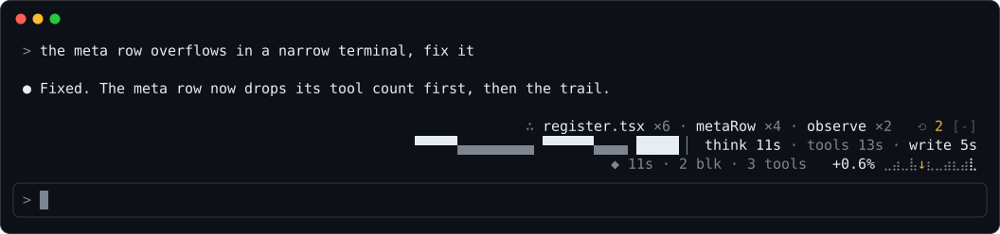
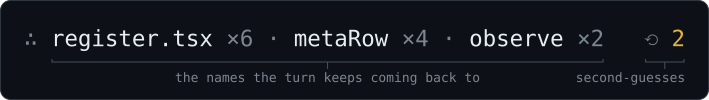
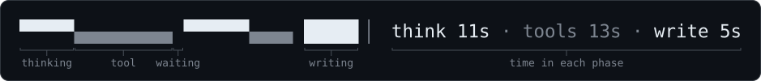
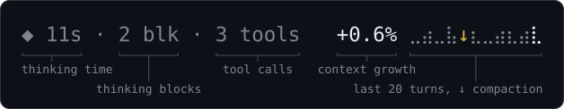
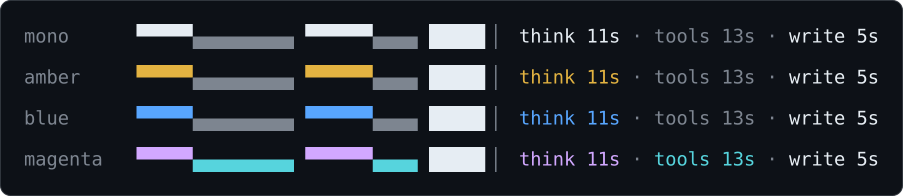

<div align="center">

# dreeft

**See what your Claude Code session's thinking is doing, right above the prompt.**

[](https://github.com/achiurizo/dreeft/actions/workflows/check.yml)
[](LICENSE)
[](#requirements)



</div>

The transcript already shows the thinking itself. dreeft is a Claude Code mod that shows the data around it, in three rows:

- **Focus**: what the thinking keeps coming back to.
- **Timeline**: where the turn's time goes.
- **Meta**: what the turn costs.

By default: no model calls, no network requests, no file writes. Only the opt-in [memory shadow log](#memory-shadow-log-experimental) makes any. The band appears when a turn starts and stays up after it ends, until the next turn starts.

## Install

Inside Claude Code:

```text
/plugin marketplace add achiurizo/dreeft
/plugin install dreeft@dreeft
```

Restart Claude Code, or run `/reload-plugins`, to load it.

<details>
<summary>Install from source</summary>

Clone the repo:

```sh
git clone https://github.com/achiurizo/dreeft.git
```

Load the clone for one session:

```sh
claude --plugin-dir ./dreeft
```

Or load the clone in every session: add its absolute path to the `env` block of `~/.claude/settings.json`.

```json
{
  "env": { "CLAUDE_CODE_PLUGIN_DIRS": "/path/to/dreeft" }
}
```

If hot reloading is enabled in a session, edits to `hooks/` take effect without a restart.

</details>

## The three rows

### Focus: what the turn keeps coming back to



- The three names the turn comes back to most, with counts. A name has to come up at least twice to show; until one does, the row reads `∴ …`.
- Names come from two places:
  - The turn's tool calls: the file a tool reads or edits, code names in a search pattern, and file names in a shell command. The file a tool reads or edits counts by its last part, whether the path uses `/` or the Windows `\`.
  - The thinking text, when thinking summaries are on: a backticked span, a file name or path, or a camelCase or snake_case identifier.
- A file name is a word that ends in one of these extensions: `.ts`, `.tsx`, `.js`, `.jsx`, `.mjs`, `.cjs`, `.json`, `.md`, `.py`, `.rb`, `.go`, `.rs`, `.sh`, `.fish`, `.toml`, `.yaml`, `.yml`, `.css`, `.html`, `.txt`. A `.tmpl` after the extension is part of the name (`chezmoi.toml.tmpl`). `Justfile`, `Makefile`, `Dockerfile`, `Gemfile` and `Rakefile` count too, in exactly that spelling.
- Plain words and directories don't count, and neither does a file with any other extension unless it is in backticks: `Make`, `makefile` and `main.cpp` are not file names.
- A turn tracks at most 50 names. Past that, the name with the lowest count goes first, the oldest on a tie, so a name the turn keeps coming back to stays.
- `⟲ 2` counts second-guesses: a sentence in the thinking that opens with "Wait,", "Actually," or "Hmm,", or that narrates a change of mind ("I realize", "turns out", "on closer inspection"). The same words used as verb or adverb ("wait for CI", "actually works") do not count. Shown in amber. Needs thinking summaries on.
- This is a word-count heuristic, not a summary, so it can pick the wrong names.

### Timeline: where the time goes



One cell per second of the turn, so the strip grows while the turn runs, tool runs included. A long turn packs several seconds into each cell so the whole turn fits. When several phases touch one cell, it shows the most notable: thinking, then tool, then writing, then waiting. A turn keeps at most 240 phase changes: past that, the shortest phase folds into the one before it, so a very long turn can lose a sub-second burst from the strip and the totals.

Each cell is two lanes, thinking on top and tools below:

| Cell | Phase |
| --- | --- |
| `▀` | Thinking |
| `▄` | Calling or running a tool |
| `█` | Writing the answer |
| blank | Waiting on the model |

A dim `▕` closes the strip, so trailing waiting time still reads as time.

After the strip, the time spent in each phase: `think 11s · tools 13s · write 5s`. A phase under half a second reads `<1s`.

Phases come from two sources: the model's chunks, and the mode of Claude Code's own spinner line (requesting, thinking, responding, tool input, tool use). The spinner still reports thinking when thinking summaries are off and no thinking text streams.

### Meta: what the turn costs



| Part | Meaning |
| --- | --- |
| `◆ 11s` | Time spent thinking this turn |
| `2 blk` | Thinking blocks this turn |
| `3 tools` | Tool calls this turn |
| `+0.6%` | How much this turn grew the context, in points of the window. Amber at 10 points or more. Negative after a compaction. |
| `⣀⣠⣤⣴` | Growth of the last 20 turns, two turns per braille cell, scaled to the largest. An amber `↓` marks a compaction, including a `/compact` between turns. |

### Good to know

- **Narrow terminals.** The meta row drops parts in this order: the tool count, then the trail. The timeline drops its totals before it shrinks below 8 cells. The focus row drops names from the end. When the band is short on rows, it keeps the bottom ones. The top row stops 4 cells short of the right edge, clear of the band's `[-]` collapse mark. Under 12 cells it draws nothing.
- **Main conversation only.** Subagent thinking and turns are ignored.
- **Quiet by default.** The mod makes no model calls, network requests or file writes, unless you turn on the experimental [memory shadow log](#memory-shadow-log-experimental).

## Requirements

- Claude Code v2.1.287 or later, which added mods. The mod API is still early access, so a Claude Code update can break the mod until it catches up.
- The terminal surface. Desktop, VS Code and mobile get nothing for now.
- Optional: thinking summaries turned on in `~/.claude/settings.json`:

  ```json
  { "showThinkingSummaries": true }
  ```

  Without this setting, the focus row gets names from tool calls only, and never counts second-guesses. The timeline and meta row work either way, because the spinner still reports thinking. With the setting on, the transcript also shows the thinking.

## Settings



| Setting | Default | Effect |
| --- | --- | --- |
| `palette` | `mono` | Timeline colors. `mono` uses brightness only (thinking plain, tools dim). `amber` and `blue` color thinking and keep tools dim. `magenta` colors thinking magenta and tools cyan. |
| `memoryShadow` | `off` | `on` turns on the experimental memory shadow log. See below. |

Change it with `/config`, or in `~/.claude/settings.json`:

```json
{
  "pluginConfigs": {
    "dreeft@dreeft": { "options": { "palette": "amber" } }
  }
}
```

The key is `dreeft@dreeft` for a marketplace install. A clone loaded with `--plugin-dir` or `CLAUDE_CODE_PLUGIN_DIRS` reads the key `dreeft` instead.

## Memory shadow log (experimental)

A spike that measures whether the session's thinking holds durable facts worth keeping as memories. It only logs. It never writes to a memory store, never stages memory candidates, and never changes the turn. The band shows nothing new.

<details>
<summary>What it logs, and how to read it</summary>

With `memoryShadow` set to `on`, the mod does three things it never does otherwise. It sends quoted thinking, quoted tool output or answer text, and the repo's `origin` URL without its credentials, query string or fragment (the repo's directory name when there is no `origin`) to the model provider, on your account. It runs `git` to find the repo and `sh` to append to the log. It writes the log file. The append needs `/bin/sh`, so macOS, Linux or WSL: on native Windows the judge call still runs and nothing is logged, so leave the setting off there. After each main-loop turn that was not interrupted:

1. Candidates come from the turn's thinking (thinking summaries must be on):
   - **hedge**: the sentence after a "wait", "actually" or "hmm" that states something, not a plan or a question.
   - **focus**: a name the turn came back to at least twice, with the thinking sentences that mention it.
2. Each candidate gets outcome evidence from the same turn: the last successful tool result that names it, else the sentence of the answer that names it. A candidate with no evidence is still logged, with `confirmed: false`.
3. One Haiku call judges the turn's candidates (at most 6) against a keep/drop rubric: keep only a fact that stays true after the session (a decision and its reason, a constraint, a gotcha, an invariant). A turn with no candidates makes no call. The call runs after the turn has completed, so it never delays it.
4. One JSON line per candidate is appended to `~/.local/state/dreeft/memory-shadow.jsonl`: `code` (eight hex characters naming the selection and judging code that wrote the line, so lines from before and after a change to the marker or the rubric can be told apart), time, session, turn, project (the `origin` URL with its credentials, query string and fragment dropped, cut to one line of at most 200 characters, or the repo's directory name when there is no `origin`), `root` (the absolute path of the repo's main checkout), candidate source, `term` (the repeated name, for a focus candidate), span, evidence, `confirmed`, the verdict (`keep`, `drop`, or `error`) and the judge's one-line `reason`, and for a keep the fact, keywords and importance, plus the memory type, name and topic a memory store could file the fact under. Each line also records the judge call's token usage.
5. Spans and evidence quote your session, so anything shaped like a credential is replaced with `[redacted]` before the judge call and the log: the value of a secret-named key or header (`SECRET=`, `token:`, `DB_PASS=`, `pwd:`, `Cookie:`, `Authorization:`), a URL password, a private key block, a password flag after a command known to take one (`mysql -p`, `curl -u`, `docker login -p`, `--password`), a vendor token with its known prefix and length (GitHub, GitLab, AWS, Google, Slack, Stripe, npm, Hugging Face, SendGrid, age, a JWT) and the AWS secret key beside a key id. A tool result is redacted before it is cut to 2,000 characters, and a repeated name that is itself shaped like a credential is not a candidate. The match is by pattern, so it can miss a secret: one in a shape not listed here, a password flag after a command it does not know, or a JWT that the cut splits before its third part starts. The log directory is created owner-only (`700`).
6. A name or span already judged in the session is not judged again.

Read the kept facts:

```sh
jq -c 'select(.verdict == "keep") | {confirmed, importance, topic, fact}' ~/.local/state/dreeft/memory-shadow.jsonl
```

</details>

## How it works

A few hooks and a one-second ticker. Every chunk passes through unchanged, and a failed state update is dropped so the turn continues.

<details>
<summary>Hooks and files</summary>

- A streaming `turn.step` hook watches the model's chunks and passes every chunk on unchanged. Each chunk updates the turn's phase spans, focus counts, and block and tool counts. When a step ends, its tool calls' arguments add to the focus counts.
- A `ui.render` hook on `Spinner` notes the spinner's mode and draws the spinner unchanged. Render hooks can't write state, so the ticker applies the noted mode as a phase, up to a second late.
- A one-second ticker runs only while a main-loop turn is running, so the timeline grows between steps while tools run. It stops when the turn completes.
- `session.measure` and each step's usage keep a running context size. `turn.complete` adds the turn's growth to the trail.
- A `ui.render` hook on the `AbovePrompt` band draws the rows from session state.
- If a state update fails, the mod drops the update and the turn continues.

| Path | Contents |
| --- | --- |
| `hooks/register.tsx` | Hooks, state atoms, render |
| `hooks/focus.ts` | Pure: the focus scan over thinking text and tool arguments |
| `hooks/turn.ts` | Pure: phase timeline, chunk reducer, context growth |
| `hooks/rows.ts` | Pure: row layout, braille trail, the band's width and rows |
| `hooks/shadow.ts` | Memory shadow log: the turn buffer |
| `hooks/shadow-candidates.ts` | Memory shadow log: candidate selection and outcome evidence |
| `hooks/shadow-judge.ts` | Memory shadow log: judge prompt, verdict parsing, log records |
| `hooks/shadow-io.ts` | Memory shadow log: the judge call and the log append |
| `types/index.d.ts` | Shape of the mod's session state |
| `hooks/*.test.ts` | Tests, run with the `claude-code/testing` kit |
| `scripts/readme-images.ts` | Draws the images in `assets/` from the row builders in `hooks/rows.ts` |

</details>

## Development

```sh
claude plugin test .                                           # run the tests
claude plugin validate --strict .claude-plugin/plugin.json     # check manifest, hooks and declared state
claude plugin validate --strict .claude-plugin/marketplace.json
claude -p x --plugin-dir . || true                             # write .claude-plugin/types (no login needed)
npx -p typescript@7.0.2 tsc -p .                               # type-check
bun scripts/readme-images.ts                                   # redraw the README images
```

Type-checking needs `.claude-plugin/types/`. Claude Code writes that folder each time a session loads the mod from a local folder, such as with `--plugin-dir`. The folder is gitignored, so a fresh clone can't type-check until a session has loaded the mod once. The `claude -p x --plugin-dir .` line does that: Claude Code writes the folder before the login check, so the command fails with no login and still leaves the types behind. A marketplace install does not write the folder.

CI runs all of these on every pull request, and fails when redrawing the images changes anything in `assets/`.

The images in this README are drawn by `scripts/readme-images.ts` from the same row builders the band uses, fed one scripted turn. They are not screenshots. Redraw them after a change to a row's layout.

## License

MIT. See [LICENSE](LICENSE).
